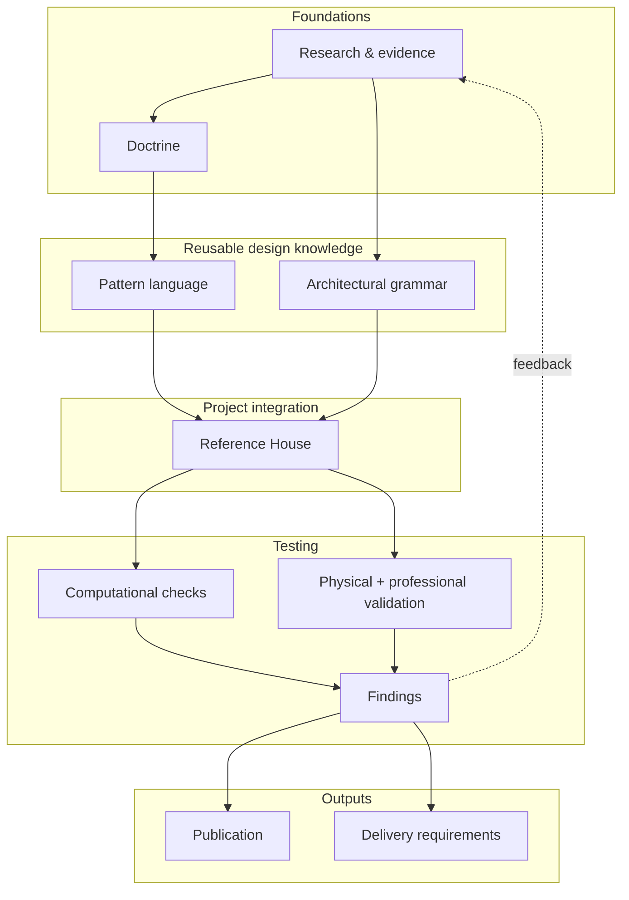

# House Systems Architecture

A house spends almost all of its life after completion. It is not one thing ageing at one rate. Structure may stand for generations while services, equipment, seals and finishes are repaired, altered and replaced around it. When those different lifetimes are physically coupled, a change to a short-lived component can require longer-lived fabric to be opened, cut and remade. Those lifetimes, and the interfaces between them, are architectural material.

**House Systems Architecture (HSA)** is a design-research programme for the house considered across that longer life. Its central concern is how architectural and technical systems meet: whether repair and replacement can remain local, foreseeable failures can be detected and contained, maintenance has enough working space, and one layer can change without needless destruction of another.

HSA does not propose a house in which everything comes apart. Capacity for change is concentrated where it earns its cost; elsewhere durability, simplicity and settled construction should win. Serviceability is one architectural demand among others. Any unusual proposition must still survive life safety, building physics, whole-life cost and carbon, ordinary workmanship and the quality of the rooms it produces.

The aim is not a visibly technical house. The opposite should be possible: rooms can feel settled and permanent because the things that must change have been given somewhere else to go.

## The proposition

Replaceability is not a property of the component alone. It is also a property of the relationships around it. A component can be ordinary, inexpensive and nominally replaceable yet still be destructive to change because reaching, disconnecting or withdrawing it requires sound fabric to be removed.

A cable route that requires masonry to be chased again, a valve that can be seen but not worked on, and a window whose removal destroys otherwise sound finishes are different manifestations of the same condition. The shorter-lived thing has been coupled unnecessarily to the longer-lived building around it.

The project therefore develops several recurring propositions:

- **Design for the building after handover.** Maintenance, repair, replacement and adaptation are design events, not matters left for future trades to improvise.
- **Separate lifetimes where separation buys something.** Shorter-lived services and assemblies should not routinely consume longer-lived fabric when they change.
- **Design the interface.** Support, restraint, movement, sealing, tolerance, access and disassembly should be resolved deliberately where systems meet.
- **Give failure and maintenance real geometry.** Inspection, isolation, working space, withdrawal routes and containment occupy space and should be designed as such.
- **Prefer ordinary parts in robust arrangements.** Novelty belongs where an arrangement or interface earns it; the building should tolerate ordinary competent workmanship and remain repairable without dependence on fragile proprietary knowledge.
- **Keep the house architectural.** Serviceability cannot justify poor rooms, technical clutter, hollow construction, fragile comfort or needless complexity. Passive architecture should do the first work, and ordinary domestic spaces should be capable of repose.

These propositions are expressed more formally in the [governing principles](docs/manuscript/governing-principles.md).

## How the project works

Evidence supports or weakens the architectural claims. **Doctrine** states the durable propositions. The **pattern language** turns those propositions into reusable responses to recurring problems. A separate **architectural grammar** governs questions such as topology, hierarchy, proportion and composition without making one architectural language part of HSA itself.

The **Reference House** then forces those layers into one building. It is where patterns, grammar, programme, structure, envelope, services, environmental strategy and maintenance geometry have to coexist rather than remain convincing in isolation. Conflicts found there can send work back upstream.

Some questions can be tested physically, some require competent professional review, and a narrower subset of relationships can be checked computationally. The publication develops the architectural argument from this work. Delivery material translates sufficiently mature findings into requirements for an appointed design team.

## Boundaries

Several distinctions are deliberately protected.

**HSA is not a historical style.** The current Reference House selects a Georgian-derived grammar, courtyard morphology and its own tectonic language. Those are project choices. They may provide evidence, but Georgian architecture, symmetry, masonry, pitched roofs or any particular decorative vocabulary are not doctrine.

**A pattern is not proof.** Patterns are reusable architectural responses with explicit trade-offs and evidence status. A pattern can fail, narrow in scope or be replaced without invalidating the principle that motivated it.

**The Reference House is not a universal solution.** It is an integration test: one sufficiently specific building used to expose conflicts that generic prose can hide.

**The computational model is subordinate to the architecture.** It formalises relationships only where deterministic checking adds something useful. Representability is not architectural merit, regulatory approval or evidence of physical adequacy.

The general promotion rule is simple: preserve the general reason upstream; keep stylistic, technical and project-specific choices at the narrowest layer that actually owns them. The detailed authority model is recorded in the [documentation structure](docs/README.md).

## Start reading

For the intended publication sequence and alternative routes through the work, use the **[Reading guide](docs/reading-guide.md)**.

The main architectural argument begins with the **[Preface](docs/manuscript/preface.md)** and continues through Parts I–V. The **[Pattern Language](docs/patterns/README.md)**, **[Architectural Grammar](docs/grammar/README.md)** and **[Reference House](docs/reference-house/README.md)** can also be explored directly as design systems.

For the live state of the research programme, open **[Project Status](STATUS.md)**. For repository ownership, canonicality and document-placement rules, use **[Documentation Structure](docs/README.md)**.