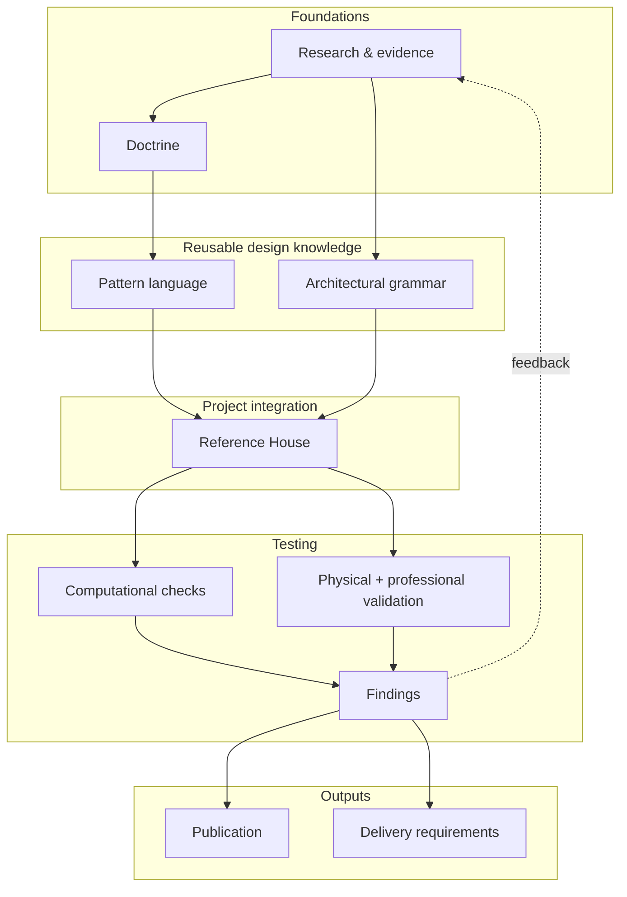

# House Systems Architecture

Architectural drawings and specifications are usually concerned with a house at or near completion. The building spends almost all of its life afterwards. Pipes leak, equipment is replaced, finishes wear, rooms are altered, and access that looked adequate on a drawing can prove useless once a person, tool or replacement component has to pass through it. Structure, envelope, services and fit-out change at different rates, but they continue to occupy the same building.

**House Systems Architecture (HSA)** is a design-research programme for that longer life. It treats the house as a set of interacting architectural and technical systems with different functions, lifetimes and rates of change. Its central concern is how those systems meet: whether repair and replacement can remain local, foreseeable failures can be detected and contained, maintenance has enough working space, and change in one layer can avoid needless destruction of another.

HSA does not try to make every part of a house equally reversible. Capacity for change is concentrated where it is likely to repay its cost. Serviceability sits alongside settled spatial order, passive-first environmental design, ordinary replaceable parts, explicit interfaces, workmanship robustness and architectural repose. Unusual propositions are still judged against life safety, building physics, whole-life cost and carbon, construction reality and architectural quality.

The aim is not a visibly technical house. Ideally the opposite is true: rooms can feel settled and permanent because the shorter-lived systems around them have somewhere else to change.

## The proposition

HSA starts from a simple observation: a component rarely fails or changes in isolation. What matters is not only how long the component lasts, but what else must be disturbed when it moves, fails or is replaced.

A cable route that requires masonry to be chased again, a valve that is technically visible but cannot be worked on, and a window whose removal destroys otherwise sound finishes are different manifestations of the same problem. The shorter-lived thing has been coupled unnecessarily to the longer-lived building around it.

The project therefore develops several recurring propositions:

- **Design for the building after handover.** Maintenance, repair, replacement and adaptation are design events, not matters left for future trades to improvise.
- **Separate lifetimes where separation buys something.** Shorter-lived services and assemblies should not routinely consume longer-lived fabric when they change.
- **Design the interface.** Support, restraint, movement, sealing, tolerance, access and disassembly should be resolved deliberately where systems meet.
- **Give failure and maintenance real geometry.** Inspection, isolation, working space, withdrawal routes and containment occupy space and should be designed as such.
- **Prefer ordinary parts in robust arrangements.** Novelty belongs where an arrangement or interface earns it; the building should tolerate ordinary competent workmanship and remain repairable without dependence on fragile proprietary knowledge.
- **Keep the house architectural.** Serviceability cannot justify poor rooms, technical clutter, hollow construction, fragile comfort or needless complexity. Passive architecture should do the first work, and ordinary domestic spaces should be capable of repose.

These propositions are expressed more formally in the [governing principles](docs/manuscript/governing-principles.md).

## How the project works

Evidence supports or weakens the architectural claims. **Doctrine** states the durable propositions. The **pattern language** turns those propositions into reusable responses to recurring problems. A separate **architectural grammar** governs questions such as topology, hierarchy, proportion and composition without making one architectural language part of HSA itself.

The **Reference House** then forces those layers into one building. It is where patterns, grammar, programme, structure, envelope, services, environmental strategy and maintenance geometry have to coexist rather than remain convincing in isolation. Conflicts found there can send work back upstream.

Some questions can be tested physically, some require competent professional review, and a narrower subset of relationships can be checked computationally. The publication develops the architectural argument from this work. Delivery material translates sufficiently mature findings into requirements for an appointed design team.

## Boundaries

Several distinctions are deliberately protected.

**HSA is not a historical style.** The current Reference House selects a Georgian-derived grammar, courtyard morphology and its own tectonic language. Those are project choices. They may provide evidence, but Georgian architecture, symmetry, masonry, pitched roofs or any particular decorative vocabulary are not doctrine.

**A pattern is not proof.** Patterns are reusable architectural responses with explicit trade-offs and evidence status. A pattern can fail, narrow in scope or be replaced without invalidating the principle that motivated it.

**The Reference House is not a universal solution.** It is an integration test: one sufficiently specific building used to expose conflicts that generic prose can hide.

**The computational model is subordinate to the architecture.** It formalises relationships only where deterministic checking adds something useful. Representability is not architectural merit, regulatory approval or evidence of physical adequacy.

The general promotion rule is simple: preserve the general reason upstream; keep stylistic, technical and project-specific choices at the narrowest layer that actually owns them. The detailed authority model is recorded in the [documentation structure](docs/README.md).

## Start reading

For the intended publication sequence and alternative routes through the work, use the **[Reading guide](docs/reading-guide.md)**.

The main architectural argument begins with the **[Preface](docs/manuscript/preface.md)** and continues through Parts I–V. The **[Pattern Language](docs/patterns/README.md)**, **[Architectural Grammar](docs/grammar/README.md)** and **[Reference House](docs/reference-house/README.md)** can also be explored directly as design systems.

For the live state of the research programme, open **[Project Status](STATUS.md)**. For repository ownership, canonicality and document-placement rules, use **[Documentation Structure](docs/README.md)**.