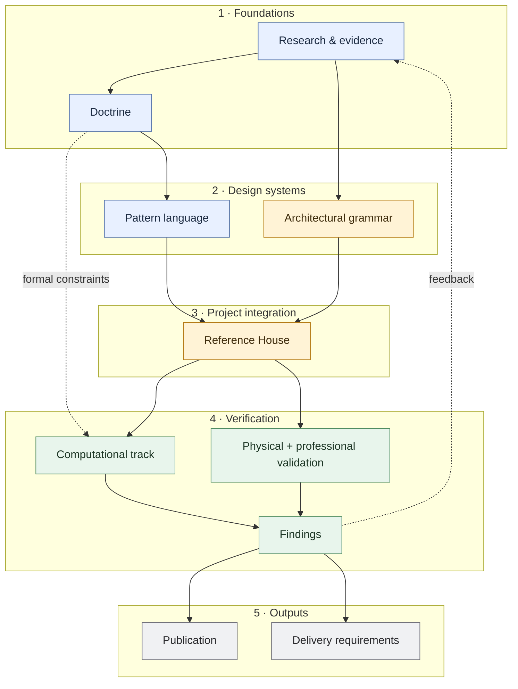

# House Systems Architecture

Most architectural information describes a house at or near completion, while the building spends almost all of its life in use. Pipes leak, equipment is replaced, finishes wear, rooms are altered, and access that looked adequate on a drawing can prove useless once a person, tool or replacement component has to pass through it. Structure, envelope, services and fit-out change at different rates, but they continue to occupy the same building.

**House Systems Architecture (HSA)** is a design-research programme for that longer life. It treats the house as a set of interacting architectural and technical systems with different jobs, lifetimes and rates of change. The central problem is how those systems should meet: how repair and replacement can remain local, how foreseeable failures can be detected and contained, how maintenance can be given real working space, and how one changing layer can avoid needlessly consuming another.

Change is concentrated where it earns its cost rather than spread indiscriminately through the building. Serviceability therefore sits alongside settled spatial order, passive-first environmental design, ordinary replaceable parts, explicit interfaces, workmanship robustness and architectural repose. Non-standard propositions still have to earn their place against life safety, building physics, whole-life cost, carbon, construction reality and architectural quality.

The project moves from general architectural principles into reusable patterns, then forces them into one deliberately specific house. Research, physical testing and professional review can change what survives. A bounded computational track formalises only the relationships that genuinely benefit from machine checking. Publication explains the system; delivery material translates mature findings into requirements for an appointed design team.

## Project map

**Colour key:** 🟦 HSA-wide knowledge · 🟨 project-specific architecture · 🟩 verification · ⬜ outward-facing outputs

The map deliberately shows the primary relationships rather than every document dependency. **Solid arrows** show the main forward flow; **dashed arrows** show constraints or findings crossing the stage structure. The Reference House is an integration test rather than proof, and the computational track remains subordinate to the architecture. Publication and delivery draw on the accumulated upstream work even where that dependency is not repeated as another arrow.

## Major components

Status uses the project maturity scale: **L1 framed · L2 developed · L3 coordinated · L4 internally validated/frozen · L5 externally validated/release-ready**. These badges are deliberately coarse summaries; **[STATUS.md](STATUS.md) is the canonical project-state record**.

### Doctrine <Badge type="info">L3 · coordinated</Badge>

The general architectural principles that should survive changes in style, construction system and individual house design. Start with the [eleven governing principles](docs/manuscript/governing-principles.md).

### Pattern language <Badge type="tip">L4 · frozen at current internal scope</Badge>

Reusable architectural responses that turn the doctrine into design moves while keeping evidence, maturity, implementation and project occurrence distinct. See the [canonical pattern language](docs/patterns/README.md).

### Research & evidence <Badge type="info">L3 · coordinated</Badge>

Evidence synthesis, precedent, options appraisal and claim hardening used to support, qualify or kill propositions rather than merely decorate them with references. See [`docs/research/`](docs/research/).

### Architectural grammar <Badge type="warning">L3 framework · G-01 still open</Badge>

The separate system that governs what kind of architecture is being made—topology, hierarchy, proportion, composition and element families—without turning one style into HSA doctrine. The Reference House currently selects the Georgian-derived [G-01 grammar](docs/computational/g01-grammar-charter.md).

### Reference House <Badge type="warning">L2–L3 · active</Badge>

The first whole-house integration test, where doctrine, selected patterns, architectural grammar, site/programme and technical systems are forced to coexist in one plausible building. See the [Reference House](docs/reference-house/README.md) and its [Pattern Occurrence Register](docs/reference-house/pattern-occurrence-register.md).

### Physical & professional validation <Badge type="warning">L1–L2 · open</Badge>

Full-scale prototypes, engineering work and competent external review used to falsify propositions that cannot be established by prose or paper modelling alone. See the [prototype programme](docs/development/tectonic-prototype-programme.md) and [prototype artefacts](docs/prototypes/README.md).

### Computational track <Badge type="info">L3 at executable P0 scope · bounded</Badge>

A subordinate formalisation track that asks which relationships can be represented strongly enough to reject invalid arrangements or expose unresolved obligations during authoring. The paper model is frozen at L4; the [P0 kernel and PAT-XW-01 gate passed](docs/computational/p0-pat-xw-01-result.md); generic compiler growth is now frozen.

### Publication <Badge type="info">L3 overall · developing</Badge>

The architectural argument presented as a coherent illustrated monograph rather than a dump of repository material. See the [publication architecture](docs/manuscript/publication-architecture.md).

### Delivery <Badge type="warning">L2 · developing</Badge>

The translation of mature findings into requirements, responsibilities, evidence gates and RIBA-stage decisions for an appointed design team. See the [RIBA implementation brief](docs/delivery/riba-implementation-brief-template.md).

## Architectural position

The recurring moves are:

- **Design for the building after handover.** Maintenance, repair, replacement, adaptation and renewal are design events.
- **Separate lifetimes where separation buys something.** Short-lived services, fittings and replaceable assemblies should not routinely require long-lived fabric to be chased, perforated or demolished with them.
- **Design the interface.** Support, restraint, movement, sealing, tolerance, access and disassembly are relationships to resolve explicitly.
- **Give failure and maintenance real geometry.** Approach, working space, isolation, disconnection and withdrawal have to fit in the building and, where necessary, around it.
- **Prefer ordinary parts in robust arrangements.** Novelty belongs where an arrangement or interface earns it, and details should tolerate ordinary competent workmanship.
- **Keep the house architectural.** Serviceability cannot justify poor rooms, technical clutter, hollow construction, fragile comfort or needless complexity.

Evidence, context-sensitive findings and architectural hypotheses are kept distinct. A pattern or prototype may fail without invalidating the principle it was intended to serve.

## Current phase

**Validation / implementation falsification.** The central doctrine, canonical pattern-language migration, pattern→computational crosswalk, architectural-specificity audit, paper compiler research and first executable compiler gate are complete at their stated internal scopes.

The highest-value unfinished work is now:

1. **Reference House coordination** — challenge the provisional footprint; resolve circulation, courtyard, structure, openings, services, drainage, external maintenance and passive-first environmental strategy as one house.
2. **Physical / engineering validation** — build and test the W2 wall bay; engineer the floor-edge proposition; test the floor platform and representative tectonic joints against strong conventional comparators.
3. **Competent external attack** — structural, building-control/fire and building-services/ventilation review.
4. **Publication development** — finish Part III/IV figures and pages, integrate evidence, close citation/glossary/back-matter gaps and proof the book after validation findings land.
5. **Delivery translation** — turn surviving propositions into explicit requirements, responsibilities and evidence gates for an appointed design team.

The computational track is no longer the default growth path. P0 passed 17 executable tests and `PAT-XW-01` added six passing crosswalk tests. Further compiler fixtures should be added only when architectural, physical or professional work exposes a concrete high-value question.

For the canonical maturity map, stop rules, unresolved risks and next gates, see **[STATUS.md](STATUS.md)**.

## Authority boundary

HSA is intentionally architecturally opinionated without making one historical style doctrinal.

The current Reference House selects a **Georgian-derived G-01 grammar**, courtyard project morphology and its own tectonic dialect. Those are downstream project choices. They may realise HSA principles, but they are not evidence that Georgian architecture, symmetry, cavity masonry, courtyard planning, pitched roofs or brass details are HSA requirements.

The rule is: **generalise the reason; localise the taste.** See the [Architectural Specificity Boundary](docs/development/architectural-specificity-boundary.md).

## Repository map

| Area | Purpose | Start here |
|---|---|---|
| **Project state** | Current maturity, risks and next gates | [STATUS.md](STATUS.md) |
| **Documentation model** | Canonicality, placement and authority rules | [`docs/README.md`](docs/README.md) |
| **Manuscript** | Public architectural argument and book structure | [Publication architecture](docs/manuscript/publication-architecture.md) · [Governing principles](docs/manuscript/governing-principles.md) · [Preface](docs/manuscript/preface.md) |
| **Patterns** | Canonical pattern language, strategies, candidates and sequences | [Pattern language](docs/patterns/README.md) · [Language model](docs/patterns/language-model.md) |
| **Reference House** | Worked architectural/technical interpretation | [Reference House](docs/reference-house/README.md) · [Pattern Occurrence Register](docs/reference-house/pattern-occurrence-register.md) |
| **Research** | Evidence synthesis, precedent and claim hardening | [`docs/research/`](docs/research/) |
| **Development** | Programme control, completed migrations/audits and prototype strategy | [`docs/development/README.md`](docs/development/README.md) |
| **Prototypes** | Build packs, drawings, test protocols and later results | [`docs/prototypes/README.md`](docs/prototypes/README.md) · [W2 wall-bay build pack](docs/prototypes/w2-wall-bay-build-pack.md) |
| **Delivery** | Requirements for an appointed design team | [RIBA implementation brief template](docs/delivery/riba-implementation-brief-template.md) |
| **Computational** | Bounded executable-architecture research and compiler fixtures | [Computational track](docs/computational/README.md) · [P0 + PAT-XW-01 result](docs/computational/p0-pat-xw-01-result.md) |
| **Source** | Frozen original doctrine retained for provenance | [House Design Doctrine v7](docs/source/house-design-doctrine-v7.md) |

## Repository rules

- **`STATUS.md` owns current project state.** Track documents may contain historical sequencing; when they disagree about what is current, `STATUS.md` and later explicit gate-result records control.
- **The governing principles are the primary public doctrine.** The v7 doctrine is preserved source material, not the live book.
- **Pattern identity does not imply truth.** Evidence and maturity remain separate from inclusion in the canonical language.
- **The Reference House is a coordination vehicle, not evidence for doctrine or pattern validity.**
- **The language is not the compiler.** Pattern provenance may inform project requirements; technical obligations derive from actual composed building relationships.
- **Architectural quality remains a hard constraint.** Maintainability and reversibility do not justify a spatially poor, visually unsettled, acoustically hollow or disproportionately complex house.
- **Repository structure and publication navigation are separate concerns.** The repository remains the source of truth; the documentation site is a curated reading interface over it.