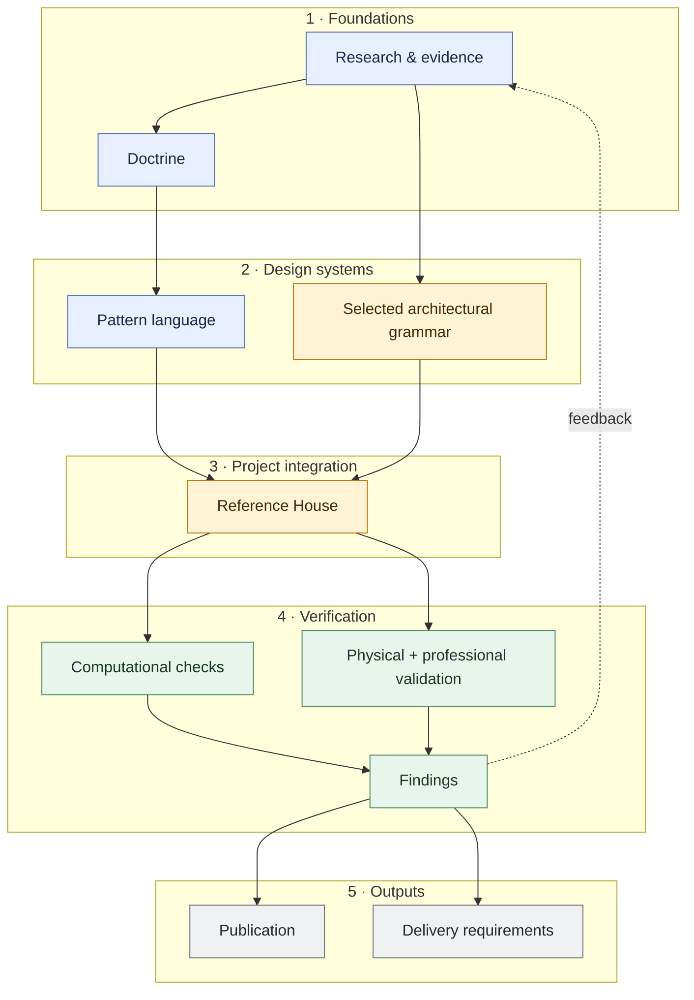

# House Systems Architecture

Architectural drawings and specifications are usually concerned with a house at or near completion. The building spends almost all of its life afterwards. Pipes leak, equipment is replaced, finishes wear, rooms are altered, and access that looked adequate on a drawing can prove useless once a person, tool or replacement component has to pass through it. Structure, envelope, services and fit-out change at different rates, but they continue to occupy the same building.

**House Systems Architecture (HSA)** is a design-research programme for that longer life. It treats the house as a set of interacting architectural and technical systems with different functions, lifetimes and rates of change. Its central concern is how those systems meet: whether repair and replacement can remain local, foreseeable failures can be detected and contained, maintenance has enough working space, and change in one layer can avoid needless destruction of another.

HSA does not try to make every part of a house equally reversible. Capacity for change is concentrated where it is likely to repay its cost. Serviceability sits alongside settled spatial order, passive-first environmental design, ordinary replaceable parts, explicit interfaces, workmanship robustness and architectural repose. Unusual propositions are still judged against life-safety requirements, building physics, whole-life cost and carbon, construction reality and architectural quality.

The work moves from evidence and governing principles into reusable patterns, then tests them in one deliberately specific Reference House. A separate architectural grammar gives that house a coherent architectural language. Physical testing and professional review challenge propositions that cannot be settled on paper, while a bounded computational track checks the subset of building relationships that can usefully be represented deterministically. The publication develops the architectural argument; findings mature enough for practice are translated into delivery requirements for an appointed design team.

## Project map

**Key:** blue — research and reusable HSA knowledge · amber — selected project architecture · green — verification · grey — outputs. Solid arrows show forward dependencies; the dashed arrow returns findings upstream.

The Reference House is an integration test, not evidence that its particular grammar or technical choices are universally correct. Publication synthesises the argument and its evidence; delivery records only those requirements mature enough to hand to an appointed team.

## Major components

The badges use the project maturity scale: **L1 framed · L2 developed · L3 coordinated · L4 internally validated/frozen · L5 externally validated/release-ready**. **[STATUS.md](STATUS.md)** is the canonical record of current maturity, risks and next gates.

### Research & evidence <Badge type="info">L3 · coordinated</Badge>

Establishes what is known, what is contested and what still needs testing through evidence synthesis, precedent and options appraisal. See [`docs/research/`](docs/research/).

### Doctrine <Badge type="info">L3 · coordinated</Badge>

The durable architectural principles that should survive changes in style, construction system and individual house design. Start with the [eleven governing principles](docs/manuscript/governing-principles.md).

### Pattern language <Badge type="tip">L4 · internally frozen</Badge>

Reusable architectural responses to recurring problems, with their forces, trade-offs, evidence and relationships made explicit. See the [canonical pattern language](docs/patterns/README.md).

### Architectural grammar <Badge type="warning">L3 framework · G-01 incomplete</Badge>

Governs topology, hierarchy, proportion, composition and element families independently of HSA doctrine. The Reference House currently selects the Georgian-derived [G-01 grammar](docs/grammar/g01-grammar-charter.md).

### Reference House <Badge type="warning">L2–L3 · active</Badge>

The first whole-house integration test: one design in which selected patterns, architectural grammar, site and programme, structure, services and environmental strategy have to coexist. See the [Reference House](docs/reference-house/README.md) and its [Pattern Occurrence Register](docs/reference-house/pattern-occurrence-register.md).

### Computational track <Badge type="info">L3 executable scope · bounded</Badge>

Formalises a limited set of building relationships so some invalid arrangements, unresolved obligations and evidence gaps can be detected deterministically. The compiler operates on the building model; pattern provenance remains a separate authoring layer. See the [P0 + PAT-XW-01 executable result](docs/computational/p0-pat-xw-01-result.md).

### Physical & professional validation <Badge type="warning">L1–L2 · open</Badge>

Tests uncertain propositions through full-scale prototypes, engineering work and external professional review. Findings can confirm, narrow or reject the proposition being tested. See the [prototype programme](docs/development/tectonic-prototype-programme.md) and [prototype artefacts](docs/prototypes/README.md).

### Publication <Badge type="info">L3 · developing</Badge>

Develops the architectural argument as a coherent illustrated monograph for a professional reader. See the [publication architecture](docs/manuscript/publication-architecture.md).

### Delivery <Badge type="warning">L2 · developing</Badge>

Translates mature findings into requirements, responsibilities, evidence gates and RIBA-stage decisions for an appointed design team. See the [RIBA implementation brief](docs/delivery/riba-implementation-brief-template.md).

## Architectural position

The doctrine repeatedly returns to six propositions:

- **Design for the building after handover.** Maintenance, repair, replacement, adaptation and renewal are design events.
- **Separate lifetimes where separation buys something.** Short-lived services, fittings and replaceable assemblies should not routinely require long-lived fabric to be chased, perforated or demolished with them.
- **Design the interface.** Support, restraint, movement, sealing, tolerance, access and disassembly are relationships to resolve explicitly.
- **Give failure and maintenance real geometry.** Approach, working space, isolation, disconnection and withdrawal have to fit in the building and, where necessary, around it.
- **Prefer ordinary parts in robust arrangements.** Novelty belongs where an arrangement or interface earns it, and details should tolerate ordinary competent workmanship.
- **Keep the house architectural.** Serviceability cannot justify poor rooms, technical clutter, hollow construction, fragile comfort or needless complexity.

A failed pattern, detail or prototype does not by itself invalidate the principle it was intended to serve. Evidence can change the implementation, narrow the claim or reject it altogether.

## Current phase

The project has moved from forming the system into testing it against implementation. Doctrine and the pattern language are now stable enough that the main uncertainties sit downstream: whole-house coordination, physical performance and external professional review.

Current work concentrates on the Reference House; the W2 wall bay, structural floor edge and floor-platform tests; structural, fire/building-control and building-services review; publication figures and evidence; and the gradual translation of mature findings into delivery requirements.

For detailed maturities, stop rules, unresolved risks and next gates, see **[STATUS.md](STATUS.md)**.

## Authority boundary

HSA takes architectural positions, but it does not prescribe a historical style. The current Reference House selects a **Georgian-derived G-01 grammar**, a courtyard morphology and its own tectonic dialect. These are project choices. Evidence from them may justify changes upstream, but the choices themselves do not become doctrine: Georgian architecture, symmetry, cavity masonry, courtyard planning, pitched roofs and brass details remain possible implementations rather than HSA requirements.

The promotion rule is: **generalise the reason; localise the taste.** See the [Architectural Specificity Boundary](docs/development/architectural-specificity-boundary.md).

## Repository map

| Area | Purpose | Start here |
|---|---|---|
| **Project state** | Current maturity, risks and next gates | [STATUS.md](STATUS.md) |
| **Documentation model** | Canonicality, placement and authority rules | [`docs/README.md`](docs/README.md) |
| **Manuscript** | Public architectural argument and book structure | [Publication architecture](docs/manuscript/publication-architecture.md) · [Governing principles](docs/manuscript/governing-principles.md) · [Preface](docs/manuscript/preface.md) |
| **Patterns** | Canonical pattern language, strategies, candidates and sequences | [Pattern language](docs/patterns/README.md) · [Language model](docs/patterns/language-model.md) |
| **Architectural grammar** | Selectable architectural-language framework and G-01 research | [Architectural grammar](docs/grammar/README.md) · [G-01 grammar charter](docs/grammar/g01-grammar-charter.md) |
| **Reference House** | Worked architectural and technical interpretation | [Reference House](docs/reference-house/README.md) · [Pattern Occurrence Register](docs/reference-house/pattern-occurrence-register.md) |
| **Research** | Evidence synthesis, precedent and claim hardening | [`docs/research/`](docs/research/) |
| **Development** | Programme control, completed migrations/audits and prototype strategy | [`docs/development/README.md`](docs/development/README.md) |
| **Prototypes** | Build packs, drawings, test protocols and later results | [`docs/prototypes/README.md`](docs/prototypes/README.md) · [W2 wall-bay build pack](docs/prototypes/w2-wall-bay-build-pack.md) |
| **Delivery** | Requirements for an appointed design team | [RIBA implementation brief template](docs/delivery/riba-implementation-brief-template.md) |
| **Computational** | Bounded executable-architecture research and compiler fixtures | [Computational track](docs/computational/README.md) · [P0 + PAT-XW-01 result](docs/computational/p0-pat-xw-01-result.md) |
| **Source** | Frozen original doctrine retained for provenance | [House Design Doctrine v7](docs/source/house-design-doctrine-v7.md) |

## Using the repository

- **`STATUS.md` owns current project state.** Older programme documents are retained as provenance; where they disagree about the present, `STATUS.md` and later explicit gate results control.
- **The governing principles are the current public doctrine.** House Design Doctrine v7 is frozen source material.
- **The Reference House is a worked interpretation, not proof of doctrine or pattern validity.**
- **The pattern language and computational model have different authority.** Pattern provenance can inform project requirements; technical obligations derive from actual composed building relationships.
- **The repository is the source of truth.** The documentation site is a curated reading interface over the same files.
