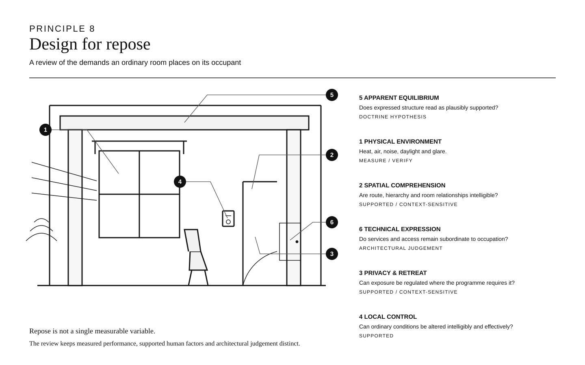

# Principle 8 — Design for Repose

**Status:** publication-spread draft v1.0  
**Evidence control:** [Repose — Evidence Audit](../research/repose-evidence-audit.md)  
**Research synthesis:** [Repose and Low Vigilance](../research/repose-and-low-vigilance.md)

> **Treat the house as a place of repeated occupation and recovery. Its ordinary spaces should minimise unnecessary vigilance by being physically comfortable, spatially comprehensible, capable of privacy and retreat, locally controllable and perceptually settled.**

A dwelling is occupied under conditions that architectural photography rarely records: tiredness, illness, interrupted sleep, work, solitude, conversation, domestic noise, changing weather and the accumulation of ordinary possessions. A house that performs well only when empty, controlled and consciously admired is not enough.

The principle of repose asks how much attention the building requires simply to remain comfortable.

Some of that burden is straightforward to measure. Overheating, cold, poor air quality, intrusive noise and disabling glare are direct environmental problems. They take priority over more speculative psychological claims. A visually serene bedroom beside an audible plant room is not a successful application of this principle.

Other burdens concern the occupant’s relationship with the house. Can a room be made private? Can direct sun be shaded? Can a window be opened, a light dimmed or the temperature altered without deciphering an opaque control system? Is there somewhere to withdraw while remaining within the household? Research on perceived control and housing privacy supports treating these as substantive design questions, while also showing why no single arrangement can be universal.

Repose does not require sparse interiors. Experimental work on architectural interiors distinguishes coherence from fascination: a scene can be rich in information while remaining comprehensible. Ornament, books, paintings, timber, stone, patterned textiles and the marks of occupation are therefore not enemies of repose. The architectural task is to give them an order capable of receiving further life.

Structure introduces a more tentative proposition. Human vision rapidly extracts support, stability and other physical properties from what it sees. The doctrine therefore prefers principal domestic spaces in which major masses appear plausibly borne and at equilibrium. This is not a claim that cantilevers are harmful, that arches are therapeutic, or that a visible load path must reproduce the engineer’s structural diagram. It is an architectural inference whose evidential status remains lower than the environmental claims above.

The same principle constrains the technical agenda of the Long-Life House. Access, replacement and legibility are not ends in themselves. A removable wall system that rattles, a service route that fills a corridor with hatches, or an ingenious floor that feels temporary underfoot has solved the maintenance problem by creating an occupation problem.

Repose is therefore not a style. It is a burden placed on design: the house should do more of the work, and ask less routine monitoring and correction of the people living in it.

*Figure 8.1 — Repose review. The six domains are deliberately not presented as one scientific scale. Physical environmental performance can often be measured directly; control, privacy and comprehensibility are supported but context-sensitive; apparent structural equilibrium remains a doctrine hypothesis; technical expression remains architectural judgement.*

## Design consequences

### Physical conditions first

Thermal comfort, indoor air quality, acoustic conditions, daylight and glare should be resolved through appropriate building-science methods. The language of repose must never be used to obscure poor measurable performance.

### Comprehensible space

The plan need not be simple, but its hierarchy should be learnable. Principal routes, thresholds, room relationships and degrees of privacy should make sense in use rather than depend on constant wayfinding or explanation.

### Regulated exposure

Shared life and privacy are both legitimate domestic needs. The house should provide meaningful choices between them rather than forcing either complete enclosure or permanent mutual exposure.

### Effective local control

Where an occupant reasonably needs to alter a condition, the means should be intelligible and effective. Automation may assist, but ordinary comfort should not depend on understanding a hidden technical system or having network access.

### Apparent equilibrium

Where structure is visible or strongly implied, support and mass should form a plausible visual relationship. Apparent precariousness is not prohibited; it should be an intentional architectural effect rather than the accidental background condition of a principal room.

### Technical subordination

Services, labels, access panels, joints and replacement interfaces should be as visible as their function and architectural role require—no more and no less. Maintainability should not make the house feel provisional or continuously technical.

## Review questions

For each principal room, ask:

1. Are temperature, air, noise and light conditions credible for long-duration occupation?
2. Can the occupant understand the room’s relation to the rest of the house?
3. Can privacy and exposure be regulated appropriately?
4. Can important immediate conditions be altered without unnecessary complexity?
5. Does the structural expression appear settled, or is tension being used deliberately?
6. Do technical systems remain subordinate to ordinary occupation?
7. Will the room remain coherent after furniture, books, pictures and everyday objects arrive?

Where the answer can be measured, measure it. Where it depends on programme or occupants, brief it. Where it remains architectural judgement, say so.
